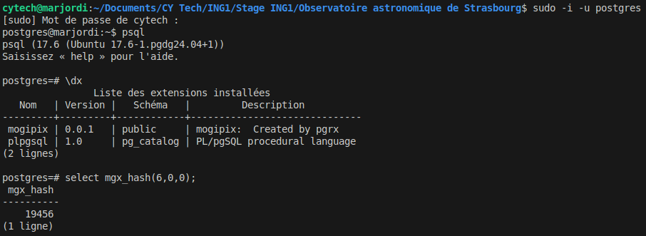

# PostgreSQL extension for HEALPix in Rust

By using this extension, you will be able to call [HEALPix](https://github.com/cds-astro/cds-healpix-rust.git) and [MOC](https://github.com/cds-astro/cds-moc-rust/tree/31e69f6e85c02043576740839f16f1d1f7e1ac77) Rust functions from PostgreSQL.

This project is based on the use of [PGRX](https://github.com/pgcentralfoundation/pgrx/tree/develop), a framework created to develop PostgreSQL extensions in Rust .   

## Installation without Rust and PGRX

If you want to use the extension without installing Rust and PGRX, please consult the [mogipix/install](https://gitlab.cds.unistra.fr/mlapointe/mogipix/-/tree/main/install) folder of this repository.

## Installation with Rust and PGRX

If you want to use the extension and install Rust and PGRX (to modify it for example), please read the following instructions.

**PGRX setup**  

  - Download the [system requirements](https://github.com/pgcentralfoundation/pgrx/blob/develop/README.md#system-requirements)

  - `cargo install --locked cargo-pgrx` : downloads PGRX
  
  - `cargo pgrx init` : initializes PGRX the first time you are using it
 
**HEALPix setup**

  - Download [the CDS HEALPix GitHub repository](https://github.com/cds-astro/cds-healpix-rust.git)
    
  - In the `mogipix/Cargo.toml` file, make sure the `[dependencies]` and `[features]` sections are configurated as below :  

  ```rust
  [dependencies]  
  pgrx = "=0.15.0" 
  cdshealpix = { git = "https://github.com/cds-astro/cds-healpix-rust.git" }
  ```
  ```rust
  [features]
  default = ["pg17"]
  ```
**Getting started**

  - `cargo pgrx run` : runs your code  
    NB : It may take a little bit of time if it is your first time running code with `pgrx`.
  
  - Please execute the whole file [setup.sql](https://gitlab.cds.unistra.fr/mlapointe/mogipix/-/blob/main/pg_regress/sql/setup.sql?ref_type=heads) to have all the PostgreSQL functions needed

**Query examples**

  Once you entered the PostgreSQL interface, you can use your Rust code through PostgreSQL queries.

- **If you already created an extension called `mogipix`**, you have to manually drop and recreate it for Postgres to consider the latest updates of your code : `mogipix=# DROP EXTENSION mogipix;`
- Creation of the extension : `mogipix=# CREATE EXTENSION mogipix;`
- As an example, let's try some queries :

  + `mogipix=# SELECT mgx_hash(<arg1>, <arg2>, <arg3>);` : returns the hash corresponding to the bmoc parameters you entered. Here is how it should look like in your console :



  + `mogipix=# CREATE INDEX mgx_hash_hip_idx ON hip_table (mgx_hash(29, raicrs, deicrs));`<br/>
  Creates an index on the hash of the BMOCs
  + `mogipix=# SELECT mgx_create_range_moc_psql(29, ARRAY[int8range(100,200),int8range(300,400)]);`<br/>
  Creates a RangeMOC at depth 29 which contains the cells contained between 100 and 200 and between 300 and 400.
  + `mogipix=# SELECT mgx_moc_to_ascii(mgx_create_range_moc_psql(29, ARRAY[int8range(100,200),int8range(300,400)]));`<br/>
  Returns the ASCII representation corresponding to the RangeMOC given in parameter.
  + `mogipix=# SELECT mgx_create_bmoc_psql(13, ARRAY[8202, 8203, 8206, 8218]) & mgx_create_bmoc_psql(13, ARRAY[8202, 8203, 8224, 8225]) AS intersection;`<br/>
  Creates a BMOC out of the intersection between 2 BMOCs
  + `mogipix=# SELECT * FROM hip_table WHERE mgx_hash_range(29, h.raicrs, h.deicrs) <@ mgx_to_int8multirange(mgx_bmoc_flag_zero(mgx_bmoc_cone_coverage_approx(mgx_best_starting_depth(5.64323)+4, 0.01814144, 3.94648893, 5.64323)));`<br/>
  Returns the cells on the border of the cone created with the parameters lon=0.01814144, lat=3.94648893 and radius=5.64323
  + `mogipix=# SELECT * FROM hip_table WHERE mgx_in_cone(0.01814144, 3.94648893, 5.64323, raicrs, deicrs);`<br/>
  Returns the cells forming a precise cone 
  + For more examples, please consult [tests.sql](https://gitlab.cds.unistra.fr/mlapointe/mogipix/-/blob/main/pg_regress/sql/tests.sql?ref_type=heads)  


**Author :** Marjorie Lapointe  
**Language :** Rust   
**Last version :** July 2025
